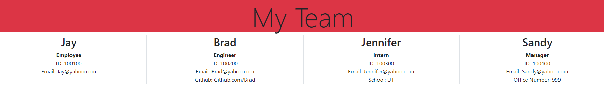

# Team Profile Generator

## Description
* This application uses Node.JS and the inquirer node package manager to generate an HTML file, which can be used to indicate information for new or existing members of an organization. The employee selection options are: 

* Generic employee
* Intern
* Manager
* Engineer

When prompted for an employee, only baseline data is requested (email, ID, name). When asked for intern, manager, or engineer, this same information is requested, with the addition of school, office number, and Github respectively for each additional role.

## Table of Contents
* [Installation](#installation)

* [Usage](#usage)

* [Contributors](#contributors)

* [License](#license)

* [Badges](#badges)

## Installation
* To use this application, you must install the dependencies using npm install. 

## Usage
* The application can be invoked using node index.js. From here, the user will be prompted with a series of questions to fill out each user. After selecting the answer "No" to the question "Want to enter another team member?", the HTML file is formed.

* This repository can be opened as an HTML within Github at the website: https://github.com/Teeemster/Team-Profile-Generator

## Testing
* To run tests, use: npm run test.

## Contributors
* Jay Beach
* University of Arizonia

## License
* This application is covered under GPL v2.

## Badges

* 
* 
